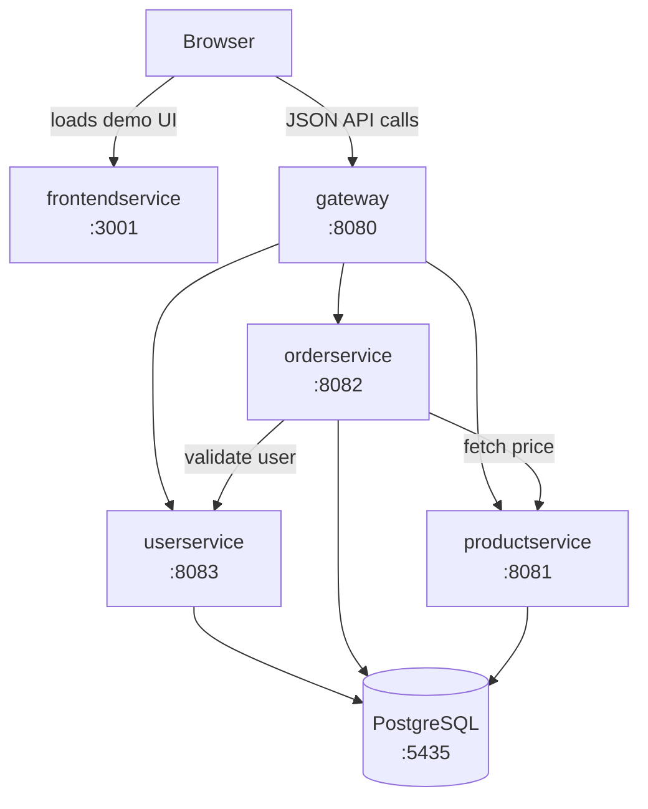

# go-microservice

A small online-store backend where separate services for users, products, and orders work together to take an order from click to database.


## Why I built this

Most tutorial projects are one app talking to one database. I wanted to practice the problems that only show up once you split things apart: how services find and call each other, what happens when a downstream service is slow or down, how one action (placing an order) touches data owned by three different services, and how to test and containerize each piece on its own. 

## Architecture



The part worth paying attention to is **order creation**: orderservice checks the user against userservice, gets the product and price from productservice, does the math, and saves the order. A real dependency between services, not just three CRUD apps sitting next to each other.

| Service                              | Port (host) | Responsibility                                    |
| ------------------------------------ | ----------- | ------------------------------------------------- |
| [gateway](./gateway)                 | 8080        | Reverse proxy; single entry point; CORS handling   |
| [productservice](./productservice)   | 8081        | Product catalog (list, get, create)                |
| [orderservice](./orderservice)       | 8082        | Orders (full CRUD); calls user + product services  |
| [userservice](./userservice)         | 8083        | Users (list, get, create)                          |
| [frontendservice](./frontendservice) | 3001        | Minimal HTML/JS demo UI                            |
| PostgreSQL                           | 5435        | Shared database instance (one table per service)   |

## Tech stack

- **Backend:** Go 1.24 (net/http standard library), GORM (ORM handling DB access and schema migration)
- **Database:** PostgreSQL 15
- **Infra:** Docker, Docker Compose (per-service Dockerfiles)
- **Testing:** Go `testing` + `httptest`, in-memory SQLite for DB-backed handlers
- **CI:** GitHub Actions — gofmt, go vet, go test, gitleaks, Docker builds on every PR and push to main

## Key features

- Five buildable services, each its own Go module and container
- One entry point (gateway) handling routing and CORS
- Cross-service order flow — user check, price lookup, total calc, in one request
- HTTP: 400/404/405/500, 502 from the gateway when a backend is down
- 32 handler tests 
- Clone → compose up → working system

## Run it

Just needs Docker (with Compose). Go matters if you want to run tests outside containers.

```bash
git clone https://github.com/celestelomeli/go-microservice.git
cd go-microservice
docker compose up --build -d
```

Open **http://localhost:3001** — create a user, place an order, look at the orders list.

Postgres seeds itself on first run (a demo user, four products). `docker compose down -v` wipes it clean.

> Host ports are picked to avoid clashing with other local stacks (Postgres on 5435, frontend on 3001). Inside the compose network everything uses its normal port.

## Using the API

Everything goes through the gateway on 8080:

```bash
curl localhost:8080/products
# [{"id":1,"name":"Laptop","price":1300}, ...]

curl -X POST localhost:8080/users \
  -H 'Content-Type: application/json' \
  -d '{"name":"Ada","email":"ada@example.com"}'
# 201 {"id":2,"name":"Ada","email":"ada@example.com"}

curl -X POST localhost:8080/orders \
  -H 'Content-Type: application/json' \
  -d '{"user_id":1,"product_id":2,"quantity":3}'
# 201 {"id":1,"user_id":1,"product_id":2,"quantity":3,"total":60}

curl localhost:8080/orders/1
curl -X PUT localhost:8080/orders/1 \
  -H 'Content-Type: application/json' -d '{"product_id":4,"quantity":1}'
curl -X DELETE localhost:8080/orders/1   # 204, or 404 if it's already gone
```

## Design decisions & tradeoffs

What I'd change for production:

- **One Postgres instance, isolated databases.** Each service gets its own database and login (provisioned by an init script), and revoked CONNECT privileges make cross-service data access impossible rather than just avoided — services can only reach each other's data through their APIs. Separate *instances* per service would be the next isolation level; one instance keeps local dev light and matches the eventual RDS layout.
- **Dev-only DB credentials in compose and the init script.** Fine for a throwaway local container holding demo data. Production would pull these from a secrets manager; moving them to a `.env` file is on the list.
- **CORS wide open (`*`)** so the demo UI works from any local origin. Would lock this to known origins for real use.
- **`sslmode=disable` on DB connections.** Fine inside the compose network 
- **No auth.** I'd add it at the gateway (JWT) rather than per-service.
- **GORM `AutoMigrate` instead of versioned migrations** — fine while each service owns exactly one table.
- **Frontend is intentionally bare.** One static page of vanilla JS just to poke at the APIs
- **No cross-service foreign keys.** Orders just hold user/product IDs and validate them via API calls at write time 

## Tests

32 handler tests — nothing needs to be running, just `go test`. DB-backed services swap Postgres for in-memory SQLite, and orderservice's calls to its neighbors hit `httptest` fakes:

```bash
for d in gateway userservice orderservice productservice; do
  (cd $d && go test -v ./...)
done
```

CI runs the same checks on every PR and push to main, plus a gitleaks scan and a Docker build of each service.

## License

[MIT](LICENSE)

